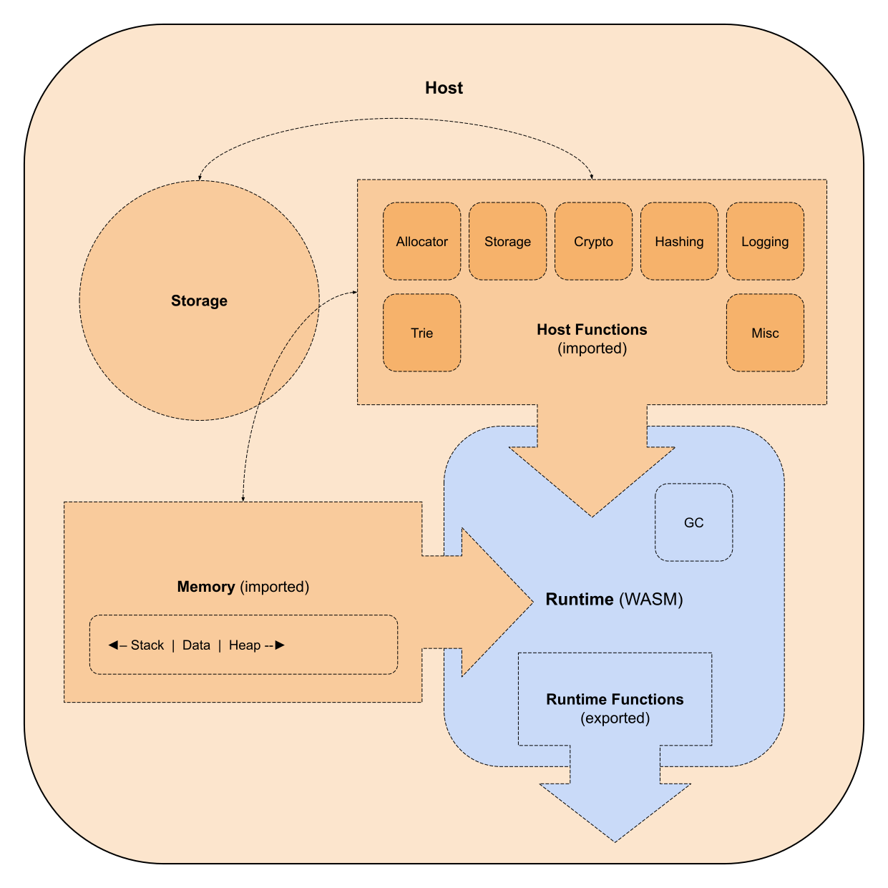

At the time of writing, the official Go compiler is not Wasm compatible with the Polkadot/Substrate requirements.
The proposed solution is based on an alternative Go compiler that aims at supporting Wasm runtimes compatible with
[Polkadot spec](https://spec.polkadot.network/id-polkadot-protocol) / [Substrate](https://docs.substrate.io/main-docs/)
that incorporates GC with external memory allocator targeting Wasm MVP.

#### WebAssembly specification

It targets [WebAssembly MVP](https://github.com/WebAssembly/design/blob/main/MVP.md) without any
extensions enabled, that offers limited set of features compared to WebAssembly 1.0. Adding on top of that,
Polkadot/Substrate specifications for the Runtime module define very domain-specific API that consist of:

* imported Host provided functions for dealing with memory, storage, crypto, logging, etc.
* imported Host provided memory.
* exported linker specific globals (`__heap_base`, `__data_end`).
* exported `__indirect_function_table` (WIP and not enabled currently).
* exported business logic API functions (`Core_version`, `Core_execute_block`, `Core_initialize_block`, etc).

Polkadot is a non-browser environment, but it is not an OS. It doesn't seek to provide access to an operating-system API
like files, networking, or any other major part of the things provided by WASI (WebAssembly System Interface).

#### SCALE codec

Runtime data, coming in the form of byte code, needs to be as light as possible. The SCALE codec provides the capability
of efficiently encoding and decoding it. Since it is built for little-endian systems, it is compatible with Wasm
environments. The runtime works with custom-defined SCALE types compatible with TinyGo. At the boundary where it
interacts with the host (memory, storage), those are converted to ordinary Go types.

#### Runtime calls

Each function call into the Runtime is done with newly allocated memory (via the shared allocator), either for sharing
input data or results. Arguments are SCALE encoded into a byte array and copied into this section of the Wasm shared
memory. Allocations do not persist between calls. It is important to note that the Runtime uses the same Host provided
allocator for all heap allocations, so the Host is in charge of the Wasm heap memory management. Data passing to the
Runtime API is always SCALE encoded, Host API calls on the other hand try to avoid all encoding.

#### GC with external memory allocator

According to the Polkadot specification, the Wasm module does not include a memory allocator. It imports memory from the
Host and relies on Host imported functions for all heap allocations. Since Go/TinyGo uses GC and manages its memory by
itself, contrary to specification, a GC with external memory allocator is implemented in our TinyGo fork to meet the
requirements of the Polkadot specification.

The design in which allocation functions are on the Host side is dictated by the fact that some Host functions might
return buffers of data of unknown size. That means that the Wasm code cannot efficiently provide buffers upfront.

For example, let's examine the Host function that returns a given storage value. The storage value's size is not known
upfront in the general case, so the Wasm caller cannot pre-allocate the buffer upfront. A potential solution is to first
call the Host function without a buffer, which will return the value's size, and then do the second call passing a
buffer of the required size. For some Host functions, caches could be put in place for mitigation, some other functions
cannot be implemented in such model at all. To solve this problem, it was chosen to place the allocator on the Host
side. However, this is not the only possible solution, as there is an ongoing discussion about moving the allocator into
the Wasm: [[1]](https://github.com/paritytech/substrate/issues/11883). Notably, the allocator maintains some of its data
structures inside the linear memory and some other structures outside.

#### Stack

Since WebAssembly has no stack introspection to scan the roots, it requires to use mirrored shadow stack in the linear
memory, pushed/popped along with the machine stack, thus making it less efficient. Also, the stack placement differs
from the one compiled from Substrate/Rust, and it is placed before the data section.

#### Exported globals

It is expected from the Runtime to export `__heap_base` global indicating the beginning of the heap. It is used by the
Host allocator to prevent memory allocations below that address and avoid clashes with the stack and data sections.

#### Imported vs exported memory

Imported memory works a little better than exported memory since it avoids some edge cases, although it also has some
downsides. Working with exported memory is almost certainly still supported and in fact, this is how it worked in the
beginning. However, the current spec describes that memory should be made available to the Polkadot Runtime for import
under the symbol name `memory`.

#### No concurrency

In Polkadot, concurrency is achieved through Parachains.
