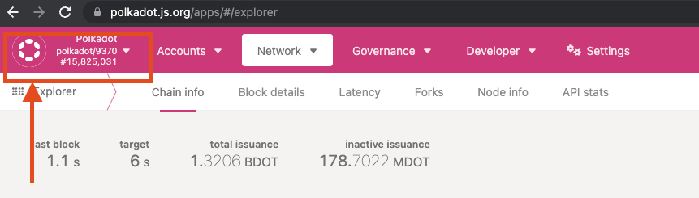
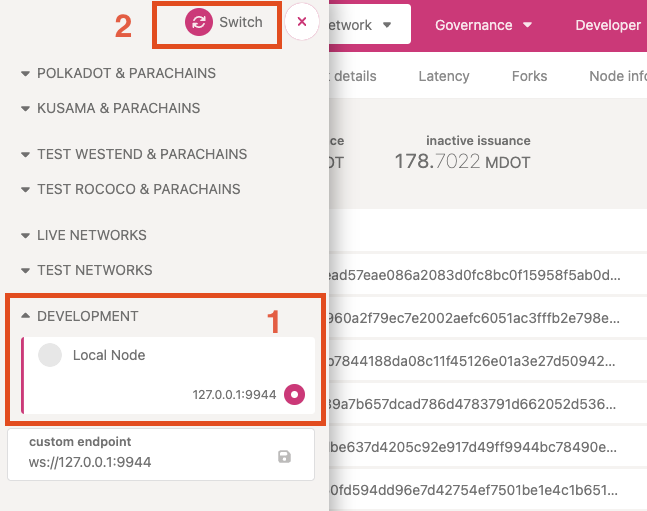
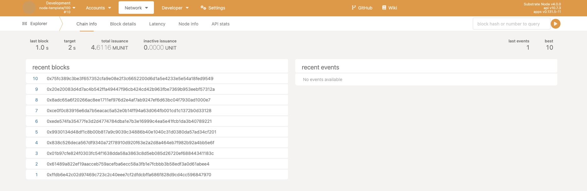
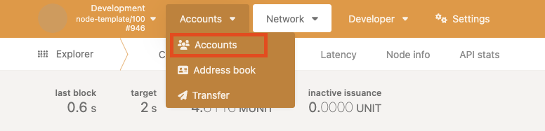
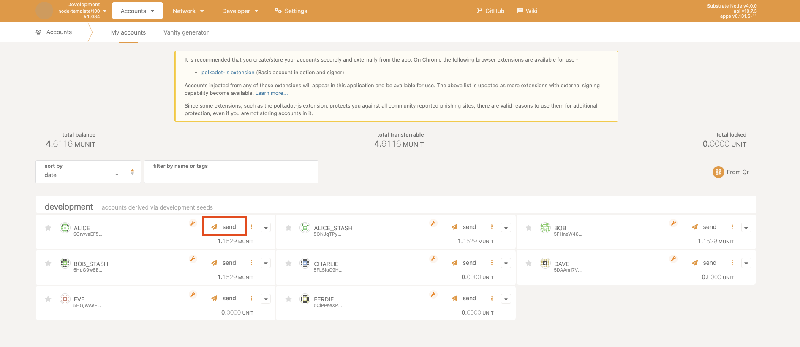
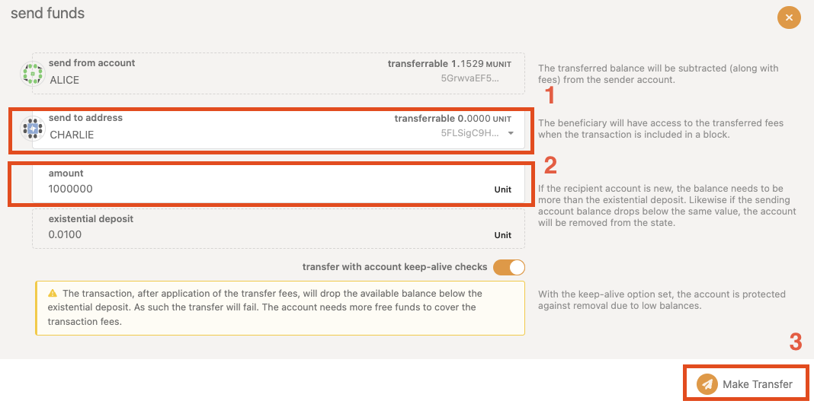
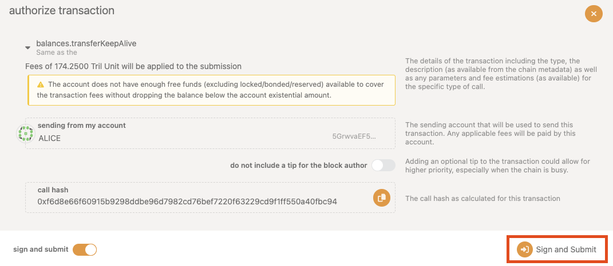
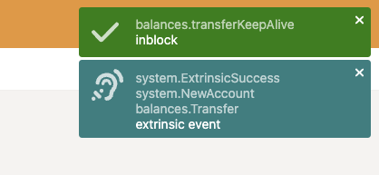
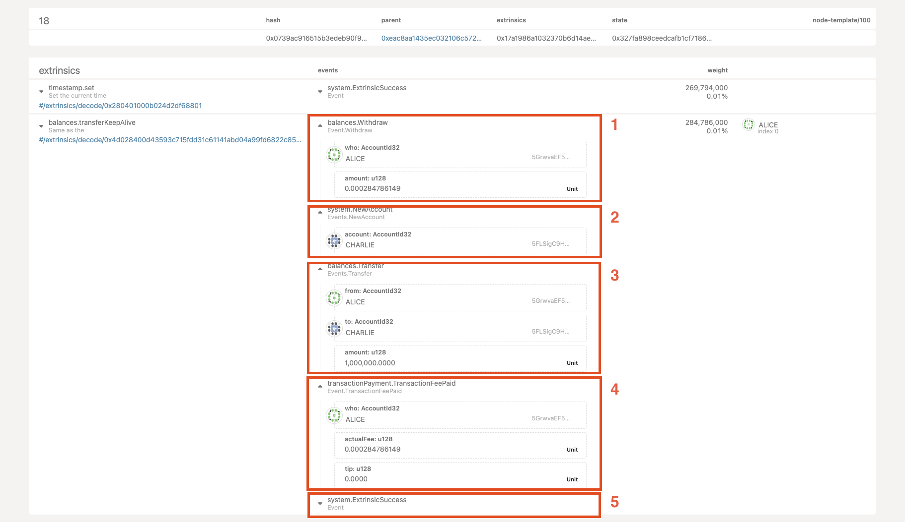

# Transfer funds

This tutorial provides steps on how to issue a transfer transaction to your local network.

After you have [started the local network](./start-a-network.md), let's make a transfer through the 
[Polkadot/Substrate Portal](https://polkadot.js.org/apps/).

1. Open [https://polkadot.js.org/apps/](https://polkadot.js.org/apps/).
2. Click the **Polkadot** logo.

    

3. Switch to local network
    1. Scroll down to **Development** tab. 
    2. Open the **Development** tab and select **Local Node**.
    3. Click **Switch**.

    
    
4. Local Network Explorer

    If your page is similar to the image below, you have successfully connected to your local node. New 
    **recent blocks** should appear every 2 seconds.

    

5. Create a transfer transaction

    Now that you have connected to your local network, let's issue a transfer transaction. The network has preconfigured 
    4 addresses to have small balances. Let's see the **Accounts** first.
    
    1. Hover over **Accounts** and click **Accounts**.
    
        

    2. Now you see the balances of all the accounts. Let's issue a transfer from **Alice**. Click **Send**.
        
        
    
    3. Send Transfer

        The **transfer** window should pop up. Let's set the **send to address** to be someone who has 0 balance.

        1. From the addresses dropdown, select **Charlie**.
        2. Input the **amount** to be **10000000**.
        3. Click **Make Transfer**.

            
        
        4. **Sign and Submit** the transfer.
       
            

        5. Once you have submitted the transfer, a green checkmark should appear in the top-right corner of your browser 
        window.
        
            

            If you get a red cross, instead of a green checkmark, this means that most likely the transfer has failed.
            To understand why the transfer has failed, find the transaction in the node explorer.

6. Inspect the transaction

    Now that the transfer has been successful, let's inspect the transfer:

    

    There are 5 events related to the transfer:

    * First, the withdrawal event, which takes the transaction fee.
    * Second, the network has to create Charlie's account, because his balance was 0 before the transfer.
    * Third, the actual transfer from Alice to Charlie.
    * Fourth, the actual fee paid for the transaction.
    * Last but not least, an event that showcases the transfer
    [transaction](https://wiki.polkadot.network/docs/learn-extrinsics) has been successful.